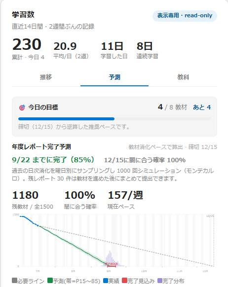
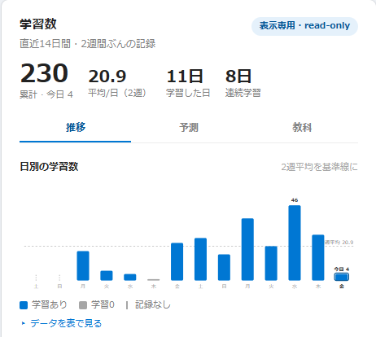
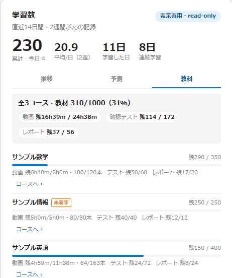
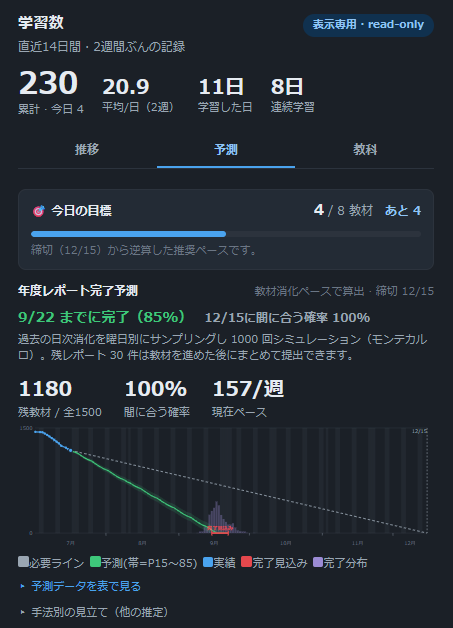

# ZEN Study 学習統計（個人用・表示専用）

自分の ZEN Study 学習データを、より見やすく・より深く可視化する個人用 Chrome 拡張。
`/setting` の学習数パネルを高機能カードに置き換え、コース/章画面に残り作業量を表示し、
サイト全体のダークモードも提供する。

> **非公式ツールです。** KADOKAWA・ドワンゴ・N高等学校／S高等学校／R高等学校・ZEN Study 各社/各校とは
> 一切関係のない、いち生徒による個人プロジェクトです。自分のアカウントで自分の学習データを
> **read-only で取得して見やすく表示するだけ**のもので、学習記録の変更や動画進捗の操作は一切行いません。
> 利用は自己責任で、各サービスの利用規約の範囲内でご使用ください。Chrome ウェブストアには公開しておらず、
> 下記「[導入](#導入chrome-へ読み込み)」の手順（リリースzip または ソースビルド）で読み込みます。

## スクリーンショット
> 画像はすべて**モックデータ**（サンプル教科名・架空の数値）です。実際の画面とは、本家サイトの
> デザイン更新・データ内容・ブラウザ環境などにより**細部が異なる場合があります**。

| 予測（北極星） | 推移 |
|:--:|:--:|
|  |  |
| **教科別の残り（残/総）** | **サイト全体ダークモード** |
|  |  |

## 導入（Chrome へ読み込み）
**A. リリースzipから（ビルド不要・おすすめ）**
1. [Releases](https://github.com/mug1ch4/zen-study-stats/releases) から `zen-study-stats-<version>.zip` を入手して展開
2. `chrome://extensions` →「デベロッパーモード」ON
3. 「パッケージ化されていない拡張機能を読み込む」→ 展開したフォルダを選択

**B. ソースからビルド**
1. `npm install && npm run build`
2. `chrome://extensions` →「デベロッパーモード」ON
3. 「パッケージ化されていない拡張機能を読み込む」→ このフォルダを選択

いずれも、ZEN Study にログインして各ページを開く（`/setting`・コース・章など）と有効になります。

## 第一原則（厳守）
1. **GET のみ。状態変更(POST/PUT/PATCH/DELETE)は一切しない（完全 read-only）**
2. 動画の不正視聴・進捗の自動進行は絶対にしない。学習記録を一切変更しない
3. 表示専用。DOM操作は自分のブラウザの描画のみ

詳細は `API_REFERENCE.md`（エンドポイント地図・調査結果）/ `DESIGN.md`（設計）。

## 主な機能
- **学習数カード**（`/setting`）: 本家パネルを上書き。本家デザイン完全準拠、a11yデータ表つき。
- **コンパクトな要点＋直下に詳細タブ**（`[推移][予測][教科]`）: 常時表示は要点ストリップ（累計・今日・平均・連続）だけに絞り、大きなグラフを含む詳細をトグルで隠さず**直下に3タブで常時表示**（この拡張の主役）。各タブは遅延描画。
  - **推移**: 日別の学習数バー（即描画）＋ 記録メタ1行（開始日・日数・最長連続）＋ **「傾向グラフ」セグメント**で `カレンダー / トレンド / 時間帯 / 曜日` を1枚ずつ切替表示（縦積みを回避しコンパクト化）。GitHub風カレンダーヒートマップ・長期トレンド（日/週/月）・時間帯トレンド・曜日別リズムを内包。
  - **予測**: 先頭に **今日のデイリークエスト**（締切から逆算した推奨ペースを「今日 N/目標・あとM教材」で提示）＋ その直下に **実績・完了見込みグラフ**（バーンダウン）を配置 ＋ 年度レポート完了予測（下記）。KPIは3点に集約、手法別の見立ては折りたたみ。デイリークエストの「今日の完了数」は**当日始点(dayStart)からの教材消化差分**で算出し、完了検知でライブ更新。
  - **教科**: 全教科の *残/総* を一覧に統合。**上部の「詳細グラフを表示」ボタン**（押すと全章を集計）で、**教科別に色分けした「残り学習量シェア」ドーナツ**（動画時間＋確認テスト/レポートを時間換算した各教科の割合。凡例＋シェア%＋スライス間ギャップで色以外でも識別可）と、動画時間・本数・確認テスト・レポートの残/総の内訳（章別＋a11y表）を表示。既定は教材の残/総一覧（クリックでコースへ）＋全体進捗ドーナツ。
  - **分析**: 先頭に **モチベーション「今日のひとこと」**（行動科学の実証手法に基づくナッジ＝下記）＋「あなたの学習傾向」— 必修アドバイス（残レポート・締切・最優先/未着手コース・必要ペース）／曜日リズム／時間帯（利用中の学習数増分から自前推定）／月ごと（前月比）／祝日／継続（コツコツ型かムラ型か・学習日率）。
- **どこでも見られるサイドパネル**（`/setting` 以外の全ページ）: 画面右端の「📊 学習統計」ハンドルから、学習カード（4タブ全部）を端からスライド表示。固定配置＋Shadow DOM隔離でページ非依存・開いた時のみデータ取得・ダーク連携。
- **モチベーション「今日のひとこと」**: 行動科学/マーケの実証手法に基づくナッジ — Endowed Progress（積み上げ強調）/ Goal-Gradient（完了間近・ラストスパート）/ Fresh Start（月曜・月初の仕切り直し）/ Implementation Intentions（ベスト曜日・時間帯から具体的計画）/ Loss Aversion（ストリーク保護）。詳細は `src/motivation.ts`。
- **控えめなトースト通知**（左下・数秒で自動消滅）: 全体%の節目達成・今日の必要最低限を達成・5:00の日付更新間近、を通知（永続dedupで繰り返さない）。
- **長期データ**（自前蓄積）: ZEN Studyを開いた日に1回スナップショット＋14日窓マージで蓄積（SWのCookie制約を回避）。
- **完了検知（観測のみ）**: 本家が完了時に送る `PUT …/progress/passed`（動画）/ `POST …/answerings`（テスト等）を **MAIN world の observer.js が観測**（HAR実測）。**我々は一切送信しない**（第一原則）。検知はトリガーに過ぎず、**実際に教材完了数(passed)が増えた時だけ**カウント（不合格の提出は passed 不変→無視）。用途: ①時間帯を"完了したその時刻"で正確に記録（誤帰属を根絶）②節目トースト③コース/章バナーの残りを即更新④**開いている予測/教科タブ（今日の目標・進捗）をライブ再描画**。集計API(passed_materials)の反映ラグに備え、増分0なら数秒間隔で最大3回まで再確認する。
- **データのバックアップ / 復元**: 蓄積した永続データ（学習数・完了レポート・教材消化の履歴／時間帯の学習記録／目標完了日／テーマ設定）を JSON で書き出し・復元。CSV は日付×学習数・完了レポート・教材消化の一覧。復元は既存と統合（履歴は日付マージ・時間帯は大きい方を採用・削除なし）。**再構築可能なキャッシュや、当日限り／端末ごとの運用状態（スナップ済みフラグ・完了検知の基準passed・当日始点・通知dedup）は除外**（復元時の不整合＝当日スナップのスキップや完了差分の破壊を防ぐため）。※読み書きは自分の `chrome.storage.local` のみで ZEN Study へは通信しない。自前蓄積データはAPIから復元不能な一点物のため喪失対策。
- **年度レポート完了予測（北極星）**: 教材消化ペースを基に、**モンテカルロ(1000回)で完了日の分布**を算出。「◯までに完了(85%)・締切に間に合う確率X%」。バーンダウン(P15〜85帯＋完了分布＋必要ライン＋**目標日ライン**)、EWMAペース、曜日/祝日考慮、目標日から必要ペース逆算、手法別の見立て。目標日を設定すると、その完了日への理想ペース線をグラフに追加描画（入力に追従・アニメーション付き）。締切は必修レポートの最終提出期限を動的取得。
- **少データ（cold-start）対策**: 導入直後は14日窓しか無く推定が不安定・過信になりがち。統計/マーケの定石で補強 — ①**14日窓の即時シード**（自前蓄積が空でも予測可）、②**ベイズ平均縮小**（少数の曜日サンプルを全体平均へ縮小し外れ日で暴れない）、③**事後予測的な母数不確実性**をモンテカルロに注入（区間が小標本ほど正しく広がる）、④**予測の確度バッジ**（データ成熟度を明示）。詳細は `src/shrinkage.ts`。
- **コース/章画面の残りサマリ**: 「このコース/この章の残り: 動画NN時間・N本 / 確認テストN / レポートN」をバナー注入。
- **サイト全体ダークモード**（自作）: filter反転でなく動的リマップ（白面→暗色/暗文字→明色、ブランド青維持）。本家ナビに馴染む「テーマ」トグル、`chrome.storage`で永続化。
- **表示アニメーション**（一般的なアプリ風の段階表示）: 棒はベースラインから伸び、折れ線は左から描かれ、ドーナツ弧は0%→実値へ、カレンダーは列ごとにポップイン、主要数値は0からカウントアップ。予測グラフは必要ライン・不確実性帯・完了分布・完了見込みも順に現れる。**OSの「動きを減らす」設定(`prefers-reduced-motion`)では一切動かさず即確定**。表示演出のみで取得・記録には影響しない。

## 開発
```bash
npm install
npm run dev        # http://localhost:5173/dev/preview.html でカードをプレビュー（モックデータ）
npm run typecheck
npm run build      # dist/content.js (IIFE) を生成
```

## 実装状況
- [x] 学習数カード（Shadow DOM注入・本家上書き・デザイン準拠・a11y表）
- [x] サイト全体ダークモード（動的リマップ・ナビトグル・永続化）
- [x] 長期データ基盤（自前蓄積 → カレンダー/トレンド/ストリーク）
- [x] コース・章ボリューム表（動画時間/テスト/レポート/進捗、batch集計＋キャッシュ）
- [x] 年度レポート完了予測（モンテカルロ＋EWMA＋曜日/祝日＋分布＋目標日逆算）
- [x] 教科別の残り（クリックでコースへ）
- [x] コース/章画面の残りサマリ注入
- [x] /setting カードの情報設計 再構成（3タブ化＋全教科の 残/総 一覧の統合）
- [x] 全体進捗ドーナツ（教科タブ・単一割合の完了ゲージ。各コース比較は棒バーのまま）
- [x] 教科別「残り学習量シェア」の色分けドーナツ（Okabe-Ito配色・validate_palette.js検証・凡例/シェア%/ギャップの二次符号化）
- [x] 表示アニメーション（棒/線/ドーナツ/カレンダー/カウントアップ・予測グラフ各要素・prefers-reduced-motion尊重）
- [x] 拡張機能アイコン（ブランド青の角丸タイル＋白の上昇棒グラフ・16/32/48/128）
- [x] 完了検知で予測/教科タブ（今日の目標）をライブ再描画（集計反映ラグに再確認リトライ）
- [x] cold-start 対策（14日窓シード＋ベイズ平均縮小＋母数不確実性＋確度バッジ）
- [x] 目標日プランナー（記憶・過去日/締切後は不可の例外処理）＋ ペース分析（完了見込みvs締切・明日の目安・ペース傾向）
- [x] 分析タブ「あなたの学習傾向」（必修アドバイス/曜日/時間帯/月/祝日/継続）＋ 時間帯を自前計測（サイト全体・20分間隔・≤60分の連続時のみ帰属）
- [x] どこでも見られるサイドパネル（他ページで端から展開）
- [x] モチベ「今日のひとこと」（Endowed Progress/Goal-Gradient/Fresh Start/Implementation Intentions/Loss Aversion）
- [x] 控えめなトースト通知（節目達成・デイリー達成・日付更新間近）
- [ ] 他カード候補（※教科レーダーは面積歪みで誤読しやすく可視化の定石上見送り。遅れ教科のボトルネック強調で代替を検討）

## 構成
```
manifest.json          MV3。content_scripts: observer.js(MAIN world)＋dist/content.js(ISOLATED)。icons(16/32/48/128)
observer.js            完了検知オブザーバ（MAIN world・本家の完了通信を観測のみ・非送信）
icons/                 拡張機能アイコン（icon16/32/48/128.png）
src/
  content.ts           エントリ（document_start観測・ルート検知・注入制御・日次スナップショット）
  inject.ts            /setting カードの Shadow DOM マウント + 本家パネル上書き（即時非表示）
  summaryInject.ts     コース/章画面の残りサマリ注入
  darkmode.ts          サイト全体ダーク（動的リマップ）+ ナビ複製トグル + 永続化
  api.ts               学習数/レポート進捗 の GET専用ラッパー + 型
  courseApi.ts         コース/章 batch取得・残り集計（GET専用）
  courseStats.ts       教材ボリューム集計（署名キャッシュ）
  history.ts           chrome.storage 蓄積（学習数/レポート/教材消化 スナップショット）
  deriveHistory.ts     カレンダー/トレンド/ストリーク 導出（純関数）
  derive.ts            KPI/ストリーク/曜日別 導出（純関数）
  predictor.ts         完了予測（EWMA・見立て・目標日・曜日カーブ・MC統合）
  montecarlo.ts        モンテカルロ（完了日分布・P値・間に合う確率＋母数不確実性の注入）
  shrinkage.ts         少データ補強（ベイズ平均縮小・相対標準誤差・正規乱数）
  holidays.ts          日本の祝日（予測カーブ用）
  format.ts            日付・曜日・時間・整形
  styles.ts            Shadow DOM CSS（本家トークン準拠, light/dark, カレンダーランプ）
  dom.ts               h()/s() 生成ヘルパー
  anim.ts              表示アニメーション補助（countUp・prefers-reduced-motion判定）
  charts/              dailyBars / weekdayBars / calendar / trend / burndown / donut / donutBreakdown / hourBars（自前SVG）
  analysis.ts          学習傾向の導出（曜日/月/祝日/継続/時間帯/必修アドバイス）
  motivation.ts        モチベ・ナッジ（行動科学の実証手法・純関数）
  notify.ts            トースト通知のトリガ判定（永続dedup）
  ui/                  learningCard / volumeTable / dataManage / dataTable / tooltip / sidePanel / toast
dev/                   preview.html / preview.ts（ブラウザ確認用・モックデータ）
```

## 補足
- content script は `www.nnn.ed.nico` 全体にマッチ（`run_at: document_start`）。SPA遷移・React再描画に MutationObserver + history パッチで追従。/setting の本家パネルは描画前(rAF)に隠してフラッシュ防止。
- 先行事例 [Level222/zen-study-plus](https://github.com/Level222/zen-study-plus)（MIT）はダーク/統計グラフ無し。本拡張は独自実装。
- 開始日/長期日別/完了日時のAPIは存在しない（`API_REFERENCE.md` 参照）ため、長期履歴は自前蓄積、予測は開始日非依存（直近ペース＋MC）。
- **日境界は 5:00 AM (JST)**: ZEN Study の日別学習数は深夜0時でなく朝5時に切り替わる。ストリーク・カレンダー・予測基点・スナップショットの日付キーはこの境界に揃える（`format.ts` の `zenTodayISO()`／端末TZ非依存）。
- 日付の "YYYY-MM-DD" は必ず `format.ts` の `parseDate`/`isoLocal` を使う（`toISOString()` はUTC基準で祝日/曜日判定がズレるため不可）。
- **学習数(累計/日別)の範囲**: `learning_amounts` は**非必修コースも含む全学習**。予測の「残教材・締切」は履修コース進捗＋必修レポート最終期限で判定するため、非必修を多く取るとペース推定が高めに出うる（予測タブに注記。履修数>必修数を検知して明示）。
- cold-start 対策の根拠（公開情報）: ベイズ平均/経験ベイズ縮小（IMDb加重平均・平均への回帰）、事後予測分布による小標本の予測区間（母数不確実性=epistemic ＋ 日々のばらつき=aleatoric を両方含める。母数不確実性を無視した区間は小標本でも広がらない）。

## 未対応（レビュー指摘・保留中）
- ダークモードの `getComputedStyle` 全要素スキャン／トグルのポーリング再設置は、ダークモード解凍時にオブザーバ駆動・静的CSS寄せへ見直す予定。

## 免責・ライセンス
- **非公式・無保証**: 本ソフトウェアは現状有姿(AS IS)で提供され、いかなる保証もありません。利用による不利益・データ損失等について作者は責任を負いません。
- **各社/各校との無関係**: KADOKAWA・ドワンゴ・N/S/R高・ZEN Study とは無関係の個人プロジェクトです。商標・名称は各権利者に帰属します。
- **設計上の安全性**: すべての通信は GET のみ（read-only）。学習記録の変更・動画進捗の自動化は行いません（`API_REFERENCE.md` 参照）。
- **ライセンス**: [MIT](LICENSE)。
